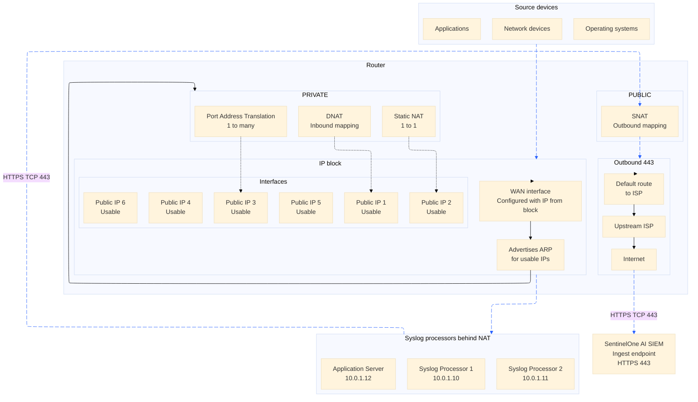

```mermaid
---
config:
  layout: elk
  theme: base
---
flowchart TB
 subgraph SOURCES["Source devices"]
        SD1["Network devices"]
        SD2["Operating systems"]
        SD3["Applications"]
  end
 subgraph INTERFACES["Interfaces"]
    direction LR
        P1["Public IP 1<br>Usable"]
        P2["Public IP 2<br>Usable"]
        P3["Public IP 3<br>Usable"]
        P4["Public IP 4<br>Usable"]
        P5["Public IP 5<br>Usable"]
        P6["Public IP 6<br>Usable"]
  end
 subgraph IPBLOCK["IP block"]
        ARP["Advertises ARP<br>for usable IPs"]
        IFACE["WAN interface<br>Configured with IP from block"]
        INTERFACES
  end
 subgraph NATPR["PRIVATE"]
        NATDNAT["DNAT<br>Inbound mapping"]
        NATSTATIC["Static NAT<br>1 to 1"]
        NATPAT["Port Address Translation<br>1 to many"]
  end
 subgraph NATPU["PUBLIC"]
        NATSNAT["SNAT<br>Outbound mapping"]
  end
 subgraph OUT443["Outbound 443"]
        DEF["Default route<br>to ISP"]
        ISP["Upstream ISP"]
        INT["Internet"]
  end
 subgraph ROUTER["Router"]
    direction TB
        IPBLOCK
        NATPR
        NATPU
        OUT443
  end
 subgraph SYSLOG["Syslog processors behind NAT"]
        S1["Syslog Processor 1<br>10.0.1.10"]
        S2["Syslog Processor 2<br>10.0.1.11"]
        S3["Application Server<br>10.0.1.12"]
  end
    SOURCES L_SOURCES_IPBLOCK_0@-.-> IPBLOCK
    IPBLOCK --> IFACE
    IFACE --> ARP
    ARP --> NATPR
    NATDNAT -.-> P1
    IPBLOCK L_IPBLOCK_SYSLOG_0@-.-> SYSLOG
    NATSTATIC -.-> P2
    NATPAT -.-> P3
    SYSLOG L_SYSLOG_NATSNAT_0@-- HTTPS TCP 443 --> NATSNAT
    NATSNAT L_NATSNAT_OUT443_0@--> OUT443
    OUT443 --> DEF
    DEF --> ISP
    ISP --> INT
    INT L_INT_S1C_0@-- HTTPS TCP 443 --> S1C["SentinelOne AI SIEM<br>Ingest endpoint<br>HTTPS 443"]
    linkStyle 0 stroke:#2962FF,fill:none
    linkStyle 5 stroke:#2962FF,fill:none
    linkStyle 8 stroke:#2962FF,fill:none
    linkStyle 9 stroke:#2962FF,fill:none
    linkStyle 13 stroke:#2962FF,fill:none
    L_SOURCES_IPBLOCK_0@{ animation: slow } 
    L_IPBLOCK_SYSLOG_0@{ animation: slow } 
    L_SYSLOG_NATSNAT_0@{ animation: slow } 
    L_NATSNAT_OUT443_0@{ animation: slow } 
    L_INT_S1C_0@{ animation: slow }
```